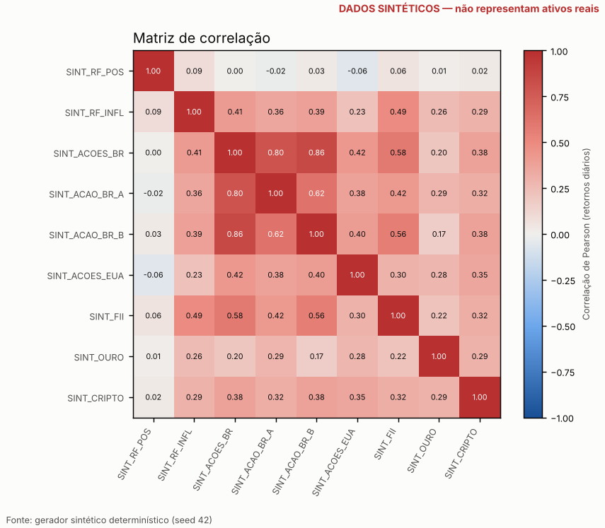
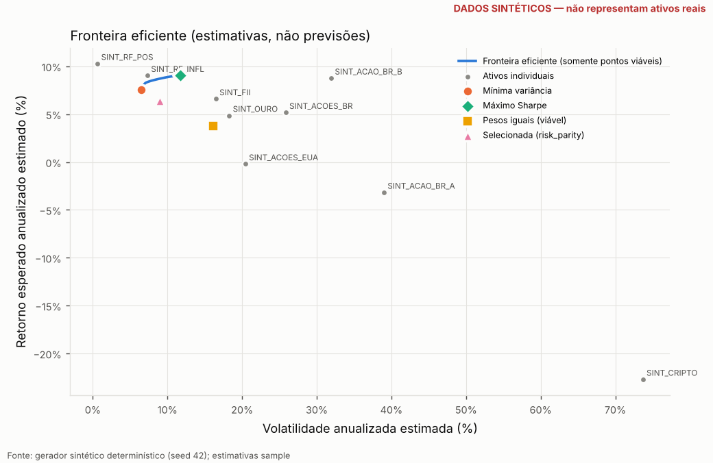
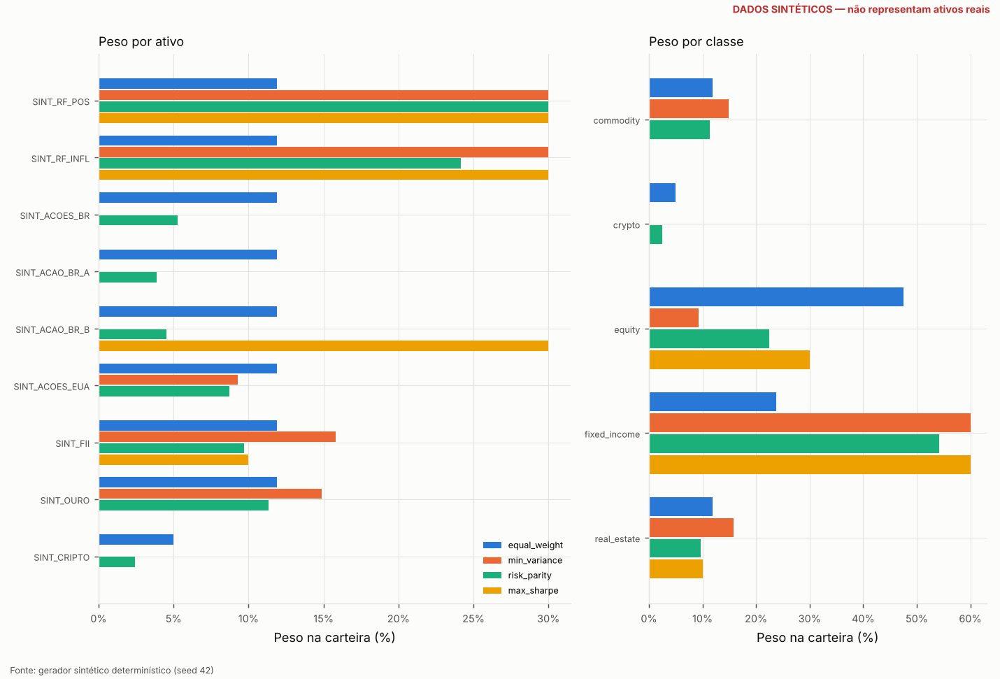
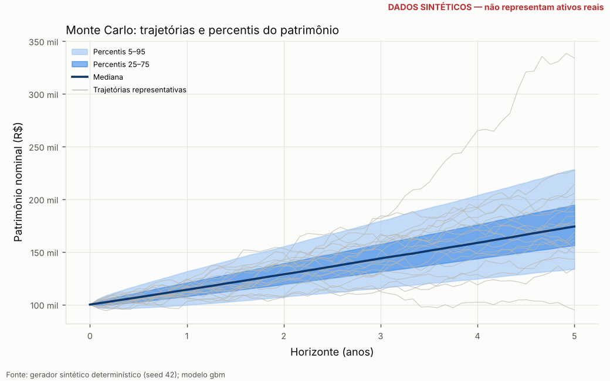
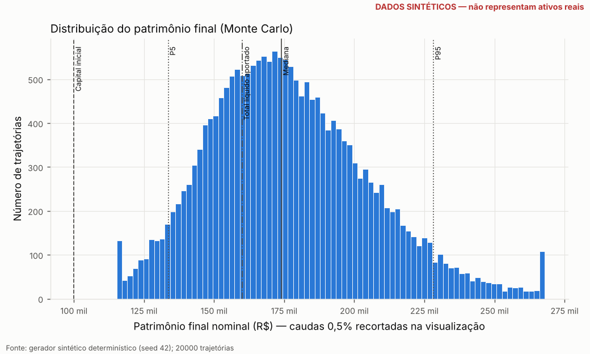
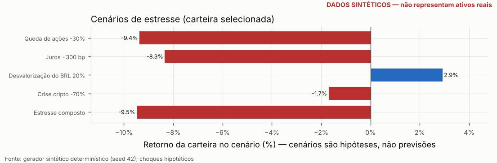
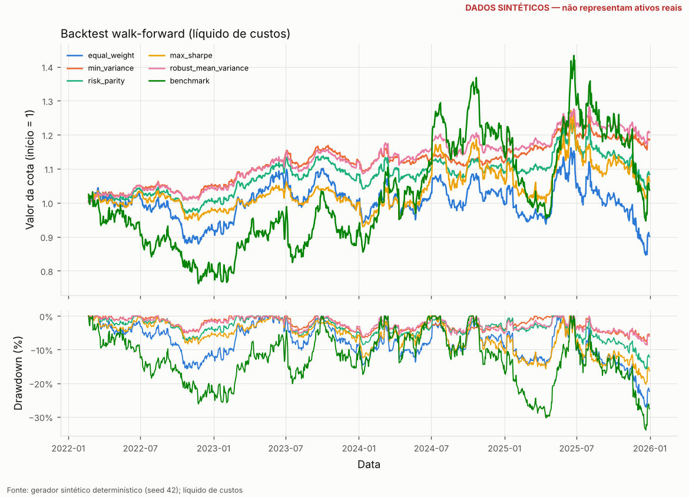

# Relatório de análise — Quant Portfolio Intelligence Engine

> **⚠ DADOS SINTÉTICOS.** Esta execução usou o gerador determinístico offline. Nenhum número abaixo descreve ativos ou mercados reais; a finalidade é demonstrar e testar a mecânica da plataforma.

> Status da validação independente: **WARNING** (PASS = sem ressalvas; WARNING = ressalvas não bloqueantes; FAIL = falha crítica). Veja a seção 13.

> Ferramenta de pesquisa e simulação. Não é recomendação de investimento, não constitui suitability regulatório e não garante resultados. Não há execução de ordens.

Legenda de natureza dos números: **[H]** histórico observado · **[E]** estimativa estatística · **[S]** simulação · **[C]** cenário hipotético.

## 1. Identificação
|  | valor |
|---|---|
| ID da execução | 20261009T045533Z-5232e4 |
| início (UTC) | 2026-10-09T04:55:33.173597+00:00 |
| fim (UTC) | 2026-10-09T04:56:25.013858+00:00 |
| versão | 0.6.0 |
| semente | 42 |
| modo | offline (sintético) |
| hash SHA-256 dos preços | 382578cbd3737914… |

## 2. Perfil e restrições
- Investidor (pseudônimo): `demo-moderado` — **exemplo hipotético**
- Capital: R$ 100.000 · aporte mensal: R$ 1.000 · horizonte: 5 anos · moeda-base: BRL
- Pontuação de tolerância 50/100 sugere **moderado**; perfil final de pesquisa: **moderado**.
- Limites de pesquisa (configuráveis, não promessas): peso máximo por ativo 30%; máximos por classe equity 60%, crypto 5%, real_estate 20%, commodity 15%; mínimos por classe fixed_income 15%; faixa de volatilidade de referência 6%–14%; drawdown de referência 20%.
- Venda a descoberto: desabilitada; alavancagem: desabilitada.
- Viabilidade das restrições: **viável**
- Classificação quantitativa inicial para pesquisa e simulação. Não constitui suitability regulatório, recomendação de investimento nem garantia de resultado.

## 3. Universo de ativos e moeda
|  | classe | setor | país | moeda | fonte dos metadados |
|---|---|---|---|---|---|
| SINT_RF_POS | fixed_income | post_fixed | BR | BRL | synthetic_generator |
| SINT_RF_INFL | fixed_income | inflation_linked | BR | BRL | synthetic_generator |
| SINT_ACOES_BR | equity | broad_market | BR | BRL | synthetic_generator |
| SINT_ACAO_BR_A | equity | materials | BR | BRL | synthetic_generator |
| SINT_ACAO_BR_B | equity | financials | BR | BRL | synthetic_generator |
| SINT_ACOES_EUA | equity | broad_market | US | BRL | synthetic_generator |
| SINT_FII | real_estate | reit | BR | BRL | synthetic_generator |
| SINT_OURO | commodity | gold | GLOBAL | BRL | synthetic_generator |
| SINT_CRIPTO | crypto | crypto | GLOBAL | BRL | synthetic_generator |

## 4. Fontes, período e qualidade dos dados
|  | provedor | origem | campo | ajuste | início | fim | n |
|---|---|---|---|---|---|---|---|
| SINT_RF_POS | synthetic_generator | synthetic | synthetic_total_return_price | synthetic (total return) | 2021-03-03 | 2025-12-31 | 1261 |
| SINT_RF_INFL | synthetic_generator | synthetic | synthetic_total_return_price | synthetic (total return) | 2021-03-03 | 2025-12-31 | 1261 |
| SINT_ACOES_BR | synthetic_generator | synthetic | synthetic_total_return_price | synthetic (total return) | 2021-03-03 | 2025-12-31 | 1261 |
| SINT_ACAO_BR_A | synthetic_generator | synthetic | synthetic_total_return_price | synthetic (total return) | 2021-03-03 | 2025-12-31 | 1261 |
| SINT_ACAO_BR_B | synthetic_generator | synthetic | synthetic_total_return_price | synthetic (total return) | 2021-03-03 | 2025-12-31 | 1261 |
| SINT_ACOES_EUA | synthetic_generator | synthetic | synthetic_total_return_price | synthetic (total return) | 2021-03-03 | 2025-12-31 | 1261 |
| SINT_FII | synthetic_generator | synthetic | synthetic_total_return_price | synthetic (total return) | 2021-03-03 | 2025-12-31 | 1261 |
| SINT_OURO | synthetic_generator | synthetic | synthetic_total_return_price | synthetic (total return) | 2021-03-03 | 2025-12-31 | 1261 |
| SINT_CRIPTO | synthetic_generator | synthetic | synthetic_total_return_price | synthetic (total return) | 2021-03-03 | 2025-12-31 | 1261 |

- Alinhamento: inner join of price dates across all symbols (no forward-fill); 0 of 1261 dates dropped. Retornos nunca são preenchidos artificialmente.
- Qualidade agregada: **ok**. Símbolos excluídos: nenhum.
- Vieses: universo definido hoje e aplicado ao passado (survivorship bias potencial); sem dados point-in-time; eventos corporativos dependem do ajuste do provedor.

## 5. Retornos, volatilidade, correlações e estimadores
Estatísticas por ativo **[H]** (média aritmética anualizada = 252 × média diária; CAGR geométrico; volatilidade = desvio-padrão diário × √252):
|  | arith_mean_ann | cagr | vol_ann | max_drawdown | skew | excess_kurtosis | sharpe | sortino | beta_vs_benchmark |
|---|---|---|---|---|---|---|---|---|---|
| SINT_RF_POS | 10.31% | 10.85% | 0.62% | -0.18% | 0.68 | 6.14 | 1.25 | 1.97 | 0.00 |
| SINT_RF_INFL | 7.75% | 7.77% | 7.31% | -8.51% | 0.66 | 9.46 | -0.24 | -0.35 | 0.12 |
| SINT_ACOES_BR | -0.15% | -3.42% | 25.83% | -44.03% | 0.07 | 3.62 | -0.37 | -0.52 | 1.00 |
| SINT_ACAO_BR_A | -17.20% | -21.98% | 38.98% | -75.64% | 0.07 | 3.28 | -0.69 | -0.94 | 1.21 |
| SINT_ACAO_BR_B | 7.19% | 2.13% | 31.92% | -35.07% | 0.08 | 4.01 | -0.07 | -0.10 | 1.06 |
| SINT_ACOES_EUA | -11.13% | -12.38% | 20.42% | -60.67% | -0.16 | 2.31 | -1.01 | -1.34 | 0.34 |
| SINT_FII | 2.77% | 1.42% | 16.47% | -26.50% | -0.13 | 5.32 | -0.41 | -0.56 | 0.37 |
| SINT_OURO | -0.77% | -2.41% | 18.26% | -34.99% | -0.08 | 2.61 | -0.56 | -0.77 | 0.14 |
| SINT_CRIPTO | -57.12% | -57.04% | 73.68% | -98.79% | 0.18 | 3.73 | -0.90 | -1.25 | 1.08 |

Retornos esperados **[E]** pelo método `james_stein` com erro-padrão (EP) da média; |t| < 2 indica que o retorno esperado não é distinguível de zero:
|  | mu | se_annual | t_stat |
|---|---|---|---|
| SINT_RF_POS | 10.28% | 0.28% | 37.11 |
| SINT_RF_INFL | 9.03% | 3.27% | 2.76 |
| SINT_ACOES_BR | 5.16% | 11.55% | 0.45 |
| SINT_ACAO_BR_A | -3.18% | 17.43% | -0.18 |
| SINT_ACAO_BR_B | 8.76% | 14.28% | 0.61 |
| SINT_ACOES_EUA | -0.21% | 9.13% | -0.02 |
| SINT_FII | 6.59% | 7.36% | 0.89 |
| SINT_OURO | 4.86% | 8.17% | 0.60 |
| SINT_CRIPTO | -22.71% | 32.95% | -0.69 |

Covariância **[E]**: `sample` {}; número de condição 16555.1; menor autovalor 3.76e-05; PSD: True.

Comparação fora da amostra de estimadores (janela 252, horizonte 63 dias, passos de 63):

| method | n_splits | gmv_realized_vol | gmv_realized_vol_se | frobenius_to_realized |
|---|---|---|---|---|
| lw_constant_corr | 16.0000 | 0.62% | 0.03% | 0.3258 |
| sample | 16.0000 | 0.62% | 0.03% | 0.3246 |
| factor_pca | 16.0000 | 0.69% | 0.03% | 0.3365 |
| ewma | 16.0000 | 0.73% | 0.04% | 0.5397 |
| oas | 16.0000 | 1.84% | 0.14% | 0.3234 |
| ledoit_wolf | 16.0000 | 2.79% | 0.22% | 0.3225 |

Seleção (regra 1-EP, mais simples): **sample** (melhor bruto: lw_constant_corr).

| method | n_splits | mse | mse_se | rank_ic_mean |
|---|---|---|---|---|
| james_stein | 16.0000 | 0.3477 | 0.0628 | 0.043 |
| grand_mean | 16.0000 | 0.3825 | 0.0704 | n/d |
| historical | 16.0000 | 0.3902 | 0.0644 | 0.043 |
| ewma | 16.0000 | 0.4070 | 0.0650 | 0.001 |

Seleção de retorno esperado (regra 1-EP): **grand_mean**. Médias amostrais são ruidosas; nenhum método deve ser escolhido por gerar retorno esperado maior.

Distribuição dos retornos diários da carteira selecionada **[H/E]**: assimetria -0.06, excesso de curtose 6.38, Jarque-Bera p=0.0000. Student-t: ν=2.05, BIC -9746.6 vs normal -9464.9 (menor é melhor). Estabilidade: ν por metade [2.05, 2.54], vol. por metade ['7.62%', '10.08%'].

Modelos de volatilidade — previsões de 1 passo fora da amostra (perda QLIKE e MSE; baseline EWMA λ=0,94):

| model | n_eval | mse | qlike |
|---|---|---|---|
| garch | 510.0000 | 0.0000 | -9.1016 |
| ewma | 510.0000 | 0.0000 | -9.0828 |
| gjr_garch | 510.0000 | 0.0000 | -9.0729 |
| rolling_hist | 510.0000 | 0.0000 | -8.9270 |

|  | dm_stat | p_value | mean_loss_diff | n |
|---|---|---|---|---|
| rolling_hist_vs_ewma | 3.98 | 0.000 | 0.1558 | 510 |
| garch_vs_ewma | -0.33 | 0.742 | -0.0188 | 510 |
| gjr_garch_vs_ewma | 0.16 | 0.874 | 0.0099 | 510 |

Seleção: **ewma** — modelo mais simples não significativamente pior (DM, 5%) que o melhor em QLIKE.

Verdade do gerador sintético vs estimativas (demonstra o erro de estimação com ~5 anos de dados; o regime de estresse eleva a volatilidade efetiva acima da 'vol. calma'):
|  | drift_continuo_verdadeiro | vol_calma_verdadeira | media_aritmetica_estimada | mu_usado | vol_estimada |
|---|---|---|---|---|---|
| SINT_RF_POS | 10.00% | 0.60% | 10.31% | 10.28% | 0.62% |
| SINT_RF_INFL | 10.50% | 6.00% | 7.75% | 9.03% | 7.31% |
| SINT_ACOES_BR | 11.00% | 22.00% | -0.15% | 5.16% | 25.83% |
| SINT_ACAO_BR_A | 12.00% | 33.00% | -17.20% | -3.18% | 38.98% |
| SINT_ACAO_BR_B | 11.00% | 27.00% | 7.19% | 8.76% | 31.92% |
| SINT_ACOES_EUA | 12.00% | 18.00% | -11.13% | -0.21% | 20.42% |
| SINT_FII | 9.00% | 14.00% | 2.77% | 6.59% | 16.47% |
| SINT_OURO | 7.00% | 16.00% | -0.77% | 4.86% | 18.26% |
| SINT_CRIPTO | 25.00% | 65.00% | -57.12% | -22.71% | 73.68% |

## 6. Benchmarks e carteiras candidatas
|  | sucesso | viável | retorno esp. [E] | vol. [E] | Sharpe [E] | observações |
|---|---|---|---|---|---|---|
| equal_weight_naive | True | False | 2.07% | 18.44% | -0.43 | class:crypto: exposição 0.1111 > máximo 0.0500; pesos iguais violam restrições |
| equal_weight | True | True | 3.77% | 16.14% | -0.39 |  |
| min_variance | True | True | 7.54% | 6.49% | -0.38 |  |
| max_sharpe | True | True | 9.08% | 11.70% | -0.08 |  |
| risk_parity | True | True | 6.43% | 8.93% | -0.40 | restrições impedem contribuições de risco iguais; solução é a mais próxima viável em mínimos quadrados |
| max_diversification | True | True | 6.52% | 7.82% | -0.44 |  |
| hrp | True | False | 10.25% | 0.62% | 0.41 | SINT_RF_POS: peso 0.9935 > máximo 0.3000; HRP não incorpora limites; violações reportadas |
| min_cvar | True | True | 7.81% | 6.55% | -0.33 |  |
| robust_mean_variance | True | True | 8.08% | 7.15% | -0.27 |  |
| target_volatility | True | True | 9.08% | 11.70% | -0.08 |  |
| resampled_max_sharpe | True | True | 8.50% | 12.24% | -0.12 |  |

`equal_weight` é a projeção viável (mínimos quadrados) de 1/N; `equal_weight_naive` e `hrp` são referências sem restrições e não são elegíveis quando violam limites.

## 7. Pesos, retorno esperado e volatilidade da carteira selecionada
Carteira selecionada: **risk_parity**. Regra: 1-SE: menor complexidade entre as estratégias elegíveis a 1 EP da melhor.
Estratégias não elegíveis (referências ou violação de limites): ['equal_weight', 'hrp', 'benchmark'].
Excluídas por volatilidade estimada acima do teto da faixa do perfil (14%): ['equal_weight'].
|  | peso | contribuição de risco (%) | classe |
|---|---|---|---|
| SINT_RF_POS | 30.00% | 0.10% | fixed_income |
| SINT_RF_INFL | 24.15% | 12.54% | fixed_income |
| SINT_ACOES_BR | 5.29% | 12.48% | equity |
| SINT_ACAO_BR_A | 3.85% | 12.47% | equity |
| SINT_ACAO_BR_B | 4.55% | 12.48% | equity |
| SINT_ACOES_EUA | 8.74% | 12.46% | equity |
| SINT_FII | 9.69% | 12.50% | real_estate |
| SINT_OURO | 11.32% | 12.49% | commodity |
| SINT_CRIPTO | 2.42% | 12.48% | crypto |

Retorno esperado **[E]** 6.43%, volatilidade estimada **[E]** 8.93%, Sharpe estimado **[E]** -0.40 (rf 10.00% — FALLBACK de demonstração).

## 8. Sharpe e métricas de risco
Desempenho histórico **[H]** dos pesos selecionados mantidos constantes (rebalanceamento diário implícito; inclui look-ahead dos pesos — apenas descritivo, ver backtest na seção 13):
|  | valor |
|---|---|
| n_obs | 1260.0000 |
| total_return | 0.1078 |
| cagr | 0.0207 |
| arith_mean_ann | 0.0245 |
| volatility_ann | 0.0893 |
| downside_dev_ann | 0.0665 |
| sharpe | -0.7932 |
| sortino | -1.0653 |
| max_drawdown | -0.1368 |
| max_dd_duration | 490.0000 |
| calmar | 0.1513 |

Concentração: HHI 0.185, N efetivo 5.40, razão de diversificação 1.51; exposição por classe {'fixed_income': 0.5415, 'equity': 0.2242, 'real_estate': 0.0969, 'commodity': 0.1132, 'crypto': 0.0242}.

## 9. Monte Carlo e percentis
### Horizonte configurado — gbm **[S]**
20000 trajetórias, 252 passos (1.00 anos), semente 42, rebalanceamento a cada 21 passos, custos de rebalanceamento 15.0 bps, aporte mensal R$ 1.000, inflação **hipotética** 4.50% a.a.
|  | patrimônio final nominal |
|---|---|
| p5 | R$ 99.533 |
| p25 | R$ 107.963 |
| p50 | R$ 114.147 |
| p75 | R$ 120.851 |
| p95 | R$ 131.245 |

- Média R$ 114.603 (erro Monte Carlo ±R$ 68); mediana real (deflacionada) R$ 109.231; total líquido aportado R$ 112.000.
- P(patrimônio final < capital inicial) = 5.54% (EP 0.16%); P(patrimônio final < total aportado) = 40.80%; P(retorno da estratégia no horizonte < 0, sem fluxos) = 40.79%.
- Drawdown máximo da cota: mediana -8.35%; 5% piores trajetórias ≤ -16.14%. Probabilidade de esgotamento: 0.00%.

### Horizonte do perfil — gbm **[S]**
20000 trajetórias, 1260 passos (5.00 anos), semente 42, rebalanceamento a cada 21 passos, custos de rebalanceamento 15.0 bps, aporte mensal R$ 1.000, inflação **hipotética** 4.50% a.a.
|  | patrimônio final nominal |
|---|---|
| p5 | R$ 133.653 |
| p25 | R$ 156.131 |
| p50 | R$ 174.023 |
| p75 | R$ 194.651 |
| p95 | R$ 228.297 |

- Média R$ 176.784 (erro Monte Carlo ±R$ 206); mediana real (deflacionada) R$ 139.645; total líquido aportado R$ 160.000.
- P(patrimônio final < capital inicial) = 0.03% (EP 0.01%); P(patrimônio final < total aportado) = 30.24%; P(retorno da estratégia no horizonte < 0, sem fluxos) = 30.05%.
- Objetivo explícito: R$ 191.610 (patrimônio final nominal >= capital inicial e aportes corrigidos pela inflação HIPOTÉTICA de 4.5% a.a.). P(atingir) = 28.14% (EP 0.32%).
- Drawdown máximo da cota: mediana -16.90%; 5% piores trajetórias ≤ -30.50%. Probabilidade de esgotamento: 0.00%.

Convergência (subconjuntos aninhados de trajetórias):
| n_paths | mean_terminal | mc_se_mean | median_terminal | p_negative_return | var95_horizon | es95_horizon |
|---|---|---|---|---|---|---|
| 500 | R$ 114.906 | R$ 427 | R$ 114.630 | 40.00% | 10.94% | 14.04% |
| 1000 | R$ 114.950 | R$ 297 | R$ 115.025 | 39.10% | 11.31% | 14.13% |
| 2000 | R$ 114.809 | R$ 212 | R$ 114.751 | 39.60% | 11.76% | 14.77% |
| 5000 | R$ 114.505 | R$ 134 | R$ 114.150 | 41.08% | 11.77% | 14.79% |
| 10000 | R$ 114.566 | R$ 95 | R$ 114.167 | 40.88% | 11.86% | 14.79% |
| 20000 | R$ 114.603 | R$ 68 | R$ 114.147 | 40.79% | 11.77% | 14.78% |

Incerteza de MODELO (mesma carteira, 5.000 trajetórias por modelo, horizonte configurado) **[S]**:
| model | median_terminal | p05_terminal | p_negative_return | var95_horizon | es95_horizon | es99_1step | mdd_median |
|---|---|---|---|---|---|---|---|
| gbm | R$ 114.277 | R$ 99.642 | 40.70% | 11.70% | 14.82% | 1.44% | -8.42% |
| student_t | R$ 113.838 | R$ 100.717 | 40.64% | 10.73% | 13.91% | 2.03% | -6.98% |
| bootstrap | R$ 114.041 | R$ 99.599 | 41.40% | 11.69% | 14.88% | 2.45% | -8.31% |
| block_bootstrap | R$ 114.103 | R$ 99.625 | 41.16% | 11.67% | 15.02% | 2.35% | -8.27% |
| garch | R$ 114.374 | R$ 99.027 | 40.28% | 12.22% | 15.45% | 1.98% | -8.40% |
| regime | R$ 114.435 | R$ 99.640 | 39.26% | 11.68% | 15.12% | 1.82% | -8.29% |
| gbm_corr+50%_vol x1.5 (cenário) | R$ 113.152 | R$ 87.048 | 47.44% | 23.47% | 28.17% | 2.72% | -16.30% |

Erro Monte Carlo (EP acima) ≠ incerteza de parâmetros (seção 12) ≠ incerteza de modelo (tabela acima).

## 10. VaR e Expected Shortfall
Perda L = −R. VaR_α = quantil α de L; ES = média de cauda (Acerbi–Tasche, trata empates). Variável: retorno diário da carteira selecionada **[H/E]**, horizonte 1 dia útil:
| method | confidence | horizon | var | es | n_obs | avisos |
|---|---|---|---|---|---|---|
| historical | 0.95 | 1 dia útil | 0.83% | 1.37% | 1260.0000 |  |
| normal | 0.95 | 1 dia útil | 0.92% | 1.15% | n/d |  |
| student_t | 0.95 | 1 dia útil | 0.88% | 1.84% | 1260.0000 |  |
| cornish_fisher | 0.95 | 1 dia útil | 0.85% | 1.70% | 1260.0000 |  |
| historical | 0.99 | 1 dia útil | 1.67% | 2.28% | 1260.0000 |  |
| normal | 0.99 | 1 dia útil | 1.30% | 1.49% | n/d |  |
| student_t | 0.99 | 1 dia útil | 2.10% | 4.16% | 1260.0000 |  |
| cornish_fisher | 0.99 | 1 dia útil | 2.16% | 3.28% | 1260.0000 |  |

Método principal configurado: **historical** — 0.95: VaR 0.83%, ES 1.37%; 0.99: VaR 1.67%, ES 2.28%

Simulado **[S]** — retorno da carteira no horizonte, sem fluxos (U_T-1) (252 passos): 0.95: VaR 11.77%, ES 14.78%; 0.99: VaR 16.77%, ES 19.12%
Simulado **[S]** — retorno da carteira no 1º passo simulado (condicional): 0.95: VaR 0.92%, ES 1.14%; 0.99: VaR 1.28%, ES 1.47%

EVT/POT (GPD sobre perdas diárias) **[E]**:
- 95%: VaR 0.841% (IC90% bootstrap 0.770%–0.933%), ES 1.372%; empírico VaR 0.834% / ES 1.369%; ξ=0.246, β=0.00337, limiar = quantil 90.0% com 126 excedências; KS p≈0.618.
  - sensibilidade ao limiar: q=0.85: VaR 0.847%; q=0.9: VaR 0.841%; q=0.925: VaR 0.845%
  - ⚠ p-valor KS aproximado: parâmetros estimados na mesma amostra (teste otimista)
- 99%: VaR 1.691% (IC90% bootstrap 1.465%–1.927%), ES 2.247%; empírico VaR 1.666% / ES 2.277%; ξ=0.023, β=0.00523, limiar = quantil 95.0% com 63 excedências; KS p≈0.743.
  - sensibilidade ao limiar: q=0.9: VaR 1.631%; q=0.925: VaR 1.651%; q=0.95: VaR 1.691%; q=0.975: recusado (apenas 32 excedências acima do limiar (quantil 97.5%); mínim…)
  - ⚠ p-valor KS aproximado: parâmetros estimados na mesma amostra (teste otimista)

Backtest de VaR fora da amostra (janela 500, Kupiec / Christoffersen; Z2 de Acerbi–Szekely < 0 indica ES subestimado):
| model | alpha | n | breaches | expected | kupiec_p | christoffersen_cc_p | independence_p | z2_es | avg_var |
|---|---|---|---|---|---|---|---|---|---|
| historical | 0.95 | 760.0000 | 56.0000 | 38.0 | 0.005 | 0.007 | 0.159 | -0.551 | 0.72% |
| normal | 0.95 | 760.0000 | 42.0000 | 38.0 | 0.512 | 0.021 | 0.007 | -0.527 | 0.82% |
| ewma_normal | 0.95 | 760.0000 | 46.0000 | 38.0 | 0.197 | 0.002 | 0.001 | -0.375 | 0.92% |
| student_t | 0.95 | 760.0000 | 52.0000 | 38.0 | 0.027 | 0.018 | 0.078 | -0.293 | 0.77% |
| historical | 0.99 | 760.0000 | 13.0000 | 7.6 | 0.074 | 0.011 | 0.016 | -0.878 | 1.54% |
| normal | 0.99 | 760.0000 | 22.0000 | 7.6 | 0.000 | 0.000 | 0.000 | -2.941 | 1.17% |
| ewma_normal | 0.99 | 760.0000 | 16.0000 | 7.6 | 0.008 | 0.020 | 0.406 | -1.412 | 1.30% |
| student_t | 0.99 | 760.0000 | 12.0000 | 7.6 | 0.139 | 0.001 | 0.000 | -0.381 | 1.61% |

## 11. Cenários de estresse e reverse stress **[C]**
| scenario | description | portfolio_return | loss_money | liquidity_cost | recovery_required | worst_contributor | baseline_return |
|---|---|---|---|---|---|---|---|
| Queda de ações -30% | Ações -30%, FII -15%, cripto -50%, ouro +5%, renda fixa -1% | -9.37% | R$ 9.366 | 0.00% | 10.33% | SINT_ACOES_EUA | -18.17% |
| Juros +300 bp | Choque paralelo +300bp (duração modificada aproximada), ações -10%, FII -12%, cripto -15% | -8.34% | R$ 8.340 | 0.00% | 9.10% | SINT_RF_INFL | -9.15% |
| Desvalorização do BRL 20% | Exposição estrangeira +20% em BRL; ações locais -8%, FII -5% | 2.92% | R$ 0 | 0.00% | 0.00% | SINT_FII | 2.31% |
| Crise cripto -70% | Criptoativos -70%; demais inalterados | -1.69% | R$ 1.695 | 0.00% | 1.72% | SINT_CRIPTO | -3.50% |
| Estresse composto | Ações -25%, FII -15%, cripto -60%, juros +200bp, BRL -15%, spreads de liquidez +150bp, vol x2 e correlações elevadas | -9.48% | R$ 9.484 | 0.75% | 10.48% | SINT_RF_INFL | -15.47% |

Choques são HIPÓTESES ilustrativas, não previsões. `baseline_return` = carteira de pesos iguais viável. Recuperação necessária = 1/(1−d) − 1.

Choques por ativo (hipóteses):
|  | SINT_RF_POS | SINT_RF_INFL | SINT_ACOES_BR | SINT_ACAO_BR_A | SINT_ACAO_BR_B | SINT_ACOES_EUA | SINT_FII | SINT_OURO | SINT_CRIPTO |
|---|---|---|---|---|---|---|---|---|---|
| Queda de ações -30% | -1.00% | -1.00% | -30.00% | -30.00% | -30.00% | -30.00% | -15.00% | 5.00% | -50.00% |
| Juros +300 bp | -0.75% | -18.00% | -10.00% | -10.00% | -10.00% | -10.00% | -12.00% | 0.00% | -15.00% |
| Desvalorização do BRL 20% | 0.00% | 0.00% | -8.00% | -8.00% | -8.00% | 20.00% | -5.00% | 20.00% | 20.00% |
| Crise cripto -70% | 0.00% | 0.00% | 0.00% | 0.00% | 0.00% | 0.00% | 0.00% | 0.00% | -70.00% |
| Estresse composto | -0.50% | -12.00% | -25.00% | -25.00% | -25.00% | -13.75% | -15.00% | 15.00% | -54.00% |

Piores janelas históricas da carteira selecionada **[H]**:
| window_days | start | end | return | recovery_required |
|---|---|---|---|---|
| 1 | 2024-03-15 | 2024-03-15 | -3.11% | 3.21% |
| 1 | 2024-04-11 | 2024-04-11 | -3.02% | 3.11% |
| 1 | 2025-06-27 | 2025-06-27 | -2.61% | 2.68% |
| 5 | 2025-06-24 | 2025-06-30 | -5.21% | 5.50% |
| 5 | 2024-03-15 | 2024-03-21 | -4.46% | 4.67% |
| 5 | 2021-06-03 | 2021-06-09 | -4.46% | 4.67% |
| 21 | 2021-05-31 | 2021-06-28 | -8.50% | 9.29% |
| 21 | 2025-06-19 | 2025-07-17 | -6.55% | 7.01% |
| 21 | 2025-11-19 | 2025-12-17 | -6.24% | 6.65% |

Crises históricas nomeadas:
| crisis | status |
|---|---|
| Crise financeira global (2008) | não aplicável: dados sintéticos |
| Joesley Day (2017) | não aplicável: dados sintéticos |
| Greve dos caminhoneiros (2018) | não aplicável: dados sintéticos |
| COVID-19 (2020) | não aplicável: dados sintéticos |
| Choque de juros global (2022) | não aplicável: dados sintéticos |

VaR 99% 1 dia gaussiano sob correlação/volatilidade estressadas **[C]** (correlação ← (1−b)·ρ + b):
| corr_blend | vol_multiplier | vol_1d | var_1d |
|---|---|---|---|
| 0.0000 | 1.0000 | 0.56% | 1.31% |
| 0.0000 | 1.5000 | 0.84% | 1.96% |
| 0.0000 | 2.0000 | 1.13% | 2.62% |
| 0.2500 | 1.0000 | 0.65% | 1.50% |
| 0.2500 | 1.5000 | 0.97% | 2.26% |
| 0.2500 | 2.0000 | 1.29% | 3.01% |
| 0.5000 | 1.0000 | 0.72% | 1.68% |
| 0.5000 | 1.5000 | 1.08% | 2.52% |
| 0.5000 | 2.0000 | 1.44% | 3.35% |
| 0.7500 | 1.0000 | 0.79% | 1.83% |
| 0.7500 | 1.5000 | 1.18% | 2.75% |
| 0.7500 | 2.0000 | 1.58% | 3.67% |

Reverse stress (limite de perda = drawdown de referência 20% em 21 dias):
- Choque gaussiano mais provável que atinge o limite: distância de Mahalanobis 7.83; probabilidade sob normal 2.35e-15, sob Student-t (ν=2.0) 1.69e-04.
|  | choque | contribuição |
|---|---|---|
| SINT_RF_POS | 0.79% | 0.24% |
| SINT_RF_INFL | -9.84% | -2.38% |
| SINT_ACOES_BR | -47.71% | -2.52% |
| SINT_ACAO_BR_A | -66.78% | -2.57% |
| SINT_ACAO_BR_B | -54.86% | -2.49% |
| SINT_ACOES_EUA | -29.75% | -2.60% |
| SINT_FII | -25.85% | -2.50% |
| SINT_OURO | -22.36% | -2.53% |
| SINT_CRIPTO | -108.89% | -2.64% |

| scenario | scenario_return | multiplier_to_breach | mathematically_possible | note |
|---|---|---|---|---|
| Queda de ações -30% | -9.37% | 2.14 | False | choques escalados ultrapassariam -100% |
| Juros +300 bp | -8.34% | 2.40 | True |  |
| Desvalorização do BRL 20% | 2.92% | n/d | False |  |
| Crise cripto -70% | -1.69% | 11.80 | False | choques escalados ultrapassariam -100% |
| Estresse composto | -9.48% | 2.11 | False | choques escalados ultrapassariam -100% |

Plausibilidade empírica **[H]**: 0 de 1240 janelas (sobrepostas) de 21 dias ultrapassaram o limite; pior observado -8.50%. Possibilidade matemática ≠ plausibilidade empírica.

Dependência de cauda — t-cópula **[E]**: ν = 4.0; log-verossimilhança t 2620.3 vs gaussiana 2147.6 (LR = 945.2). λ teórico médio fora da diagonal: 0.166.

Liquidez (participação máxima de 10% do volume médio diário em valor, 63 dias):
| symbol | position_value | days_to_liquidate | spread_bps_assumed | source |
|---|---|---|---|---|
| SINT_RF_POS | R$ 30.000 | 0.00 | 5.0 | volume observado (média diária em valor) |
| SINT_RF_INFL | R$ 24.152 | 0.00 | 5.0 | volume observado (média diária em valor) |
| SINT_ACOES_BR | R$ 5.285 | 0.00 | 5.0 | volume observado (média diária em valor) |
| SINT_ACAO_BR_A | R$ 3.855 | 0.00 | 5.0 | volume observado (média diária em valor) |
| SINT_ACAO_BR_B | R$ 4.547 | 0.00 | 5.0 | volume observado (média diária em valor) |
| SINT_ACOES_EUA | R$ 8.736 | 0.00 | 5.0 | volume observado (média diária em valor) |
| SINT_FII | R$ 9.685 | 0.00 | 5.0 | volume observado (média diária em valor) |
| SINT_OURO | R$ 11.317 | 0.00 | 5.0 | volume observado (média diária em valor) |
| SINT_CRIPTO | R$ 2.421 | 0.00 | 5.0 | volume observado (média diária em valor) |
Volumes também são SINTÉTICOS.

## 12. Contribuições de risco, papel dos ativos e robustez
MRC_i = (Σw)_i/σ_p; RC_i = w_i·MRC_i; Σ RC_i = σ_p (verificado na seção 13).
|  | weight | mrc | rc | rc_pct |
|---|---|---|---|---|
| SINT_RF_POS | 30.00% | 0.03% | 0.01% | 0.10% |
| SINT_RF_INFL | 24.15% | 4.64% | 1.12% | 12.54% |
| SINT_ACOES_BR | 5.29% | 21.09% | 1.11% | 12.48% |
| SINT_ACAO_BR_A | 3.85% | 28.89% | 1.11% | 12.47% |
| SINT_ACAO_BR_B | 4.55% | 24.52% | 1.12% | 12.48% |
| SINT_ACOES_EUA | 8.74% | 12.75% | 1.11% | 12.46% |
| SINT_FII | 9.69% | 11.53% | 1.12% | 12.50% |
| SINT_OURO | 11.32% | 9.86% | 1.12% | 12.49% |
| SINT_CRIPTO | 2.42% | 46.04% | 1.11% | 12.48% |

Papel de cada ativo (observações históricas + hipóteses de cenário):
| symbol | class | weight | rc_pct | corr_with_portfolio | worst_hypothetical_scenario | worst_scenario_shock | data_quality | role |
|---|---|---|---|---|---|---|---|---|
| SINT_RF_POS | fixed_income | 30.00% | 0.10% | 0.05 | Queda de ações -30% | -1.00% | ok | no teto individual (30%): restrição ativa; redutor de volatilidade (vol. individual < vol. da carteira); diversificador (baixa correlação com a carteira) |
| SINT_RF_INFL | fixed_income | 24.15% | 12.54% | 0.63 | Juros +300 bp | -18.00% | ok | redutor de volatilidade (vol. individual < vol. da carteira) |
| SINT_ACOES_BR | equity | 5.29% | 12.48% | 0.82 | Queda de ações -30% | -30.00% | ok | concentra risco (contribuição de risco > 1,5x o peso) |
| SINT_ACAO_BR_A | equity | 3.85% | 12.47% | 0.74 | Queda de ações -30% | -30.00% | ok | concentra risco (contribuição de risco > 1,5x o peso) |
| SINT_ACAO_BR_B | equity | 4.55% | 12.48% | 0.77 | Queda de ações -30% | -30.00% | ok | concentra risco (contribuição de risco > 1,5x o peso) |
| SINT_ACOES_EUA | equity | 8.74% | 12.46% | 0.62 | Queda de ações -30% | -30.00% | ok | exposição a ativos/moeda estrangeiros |
| SINT_FII | real_estate | 9.69% | 12.50% | 0.70 | Queda de ações -30% | -15.00% | ok |  |
| SINT_OURO | commodity | 11.32% | 12.49% | 0.54 | Juros +300 bp | 0.00% | ok | exposição a ativos/moeda estrangeiros |
| SINT_CRIPTO | crypto | 2.42% | 12.48% | 0.62 | Crise cripto -70% | -70.00% | ok | concentra risco (contribuição de risco > 1,5x o peso); exposição a ativos/moeda estrangeiros |

Robustez — sensibilidade do **máximo Sharpe** (o otimizador mais dependente de μ):
|  | base | mean | std | min | max |
|---|---|---|---|---|---|
| SINT_RF_POS | 30.00% | 30.00% | 0.00% | 30.00% | 30.00% |
| SINT_RF_INFL | 30.00% | 23.18% | 10.13% | 0.00% | 30.00% |
| SINT_ACOES_BR | 0.00% | 7.33% | 12.85% | 0.00% | 30.00% |
| SINT_ACAO_BR_A | 0.00% | 10.13% | 13.41% | 0.00% | 30.00% |
| SINT_ACAO_BR_B | 30.00% | 16.81% | 13.75% | 0.00% | 30.00% |
| SINT_ACOES_EUA | 0.00% | 3.72% | 9.14% | 0.00% | 30.00% |
| SINT_FII | 10.00% | 5.22% | 8.12% | 0.00% | 20.00% |
| SINT_OURO | 0.00% | 3.43% | 5.50% | 0.00% | 15.00% |
| SINT_CRIPTO | 0.00% | 0.17% | 0.91% | 0.00% | 5.00% |

Variação por estimador e janela (distância L1 aos pesos-base; 2 = carteiras disjuntas):
| variant | success | exp_ret_base_inputs | vol_base_inputs | l1_vs_base |
|---|---|---|---|---|
| cov=sample | True | 9.08% | 11.70% | 0.000 |
| cov=ledoit_wolf | True | 9.08% | 11.70% | 0.000 |
| cov=lw_constant_corr | True | 9.08% | 11.70% | 0.000 |
| cov=oas | True | 9.08% | 11.70% | 0.000 |
| cov=ewma | True | 9.08% | 11.70% | 0.000 |
| cov=factor_pca | True | 9.08% | 11.70% | 0.000 |
| mu=historical | True | 9.08% | 11.70% | 0.000 |
| mu=ewma | True | 8.90% | 11.15% | 0.200 |
| mu=james_stein | True | 9.08% | 11.70% | 0.000 |
| mu=grand_mean | True | 3.21% | 23.35% | 0.900 |
| janela=primeira metade | True | 6.39% | 7.79% | 0.600 |
| janela=segunda metade | True | 8.16% | 17.01% | 0.600 |
| janela=últimos 252 | True | 9.08% | 11.70% | 0.000 |

Reamostragem em blocos (50 reamostragens válidas, 0 falhas): distância L1 média aos pesos-base = 0.305.
|  | base | mean | std | p05 | p95 |
|---|---|---|---|---|---|
| SINT_RF_POS | 30.00% | 30.00% | 0.00% | 30.00% | 30.00% |
| SINT_RF_INFL | 30.00% | 24.22% | 9.59% | 3.88% | 30.00% |
| SINT_ACOES_BR | 0.00% | 6.91% | 10.09% | 0.00% | 30.00% |
| SINT_ACAO_BR_A | 0.00% | 1.30% | 5.96% | 0.00% | 2.75% |
| SINT_ACAO_BR_B | 30.00% | 27.15% | 7.65% | 5.71% | 30.00% |
| SINT_ACOES_EUA | 0.00% | 0.60% | 4.24% | 0.00% | 0.00% |
| SINT_FII | 10.00% | 5.05% | 7.67% | 0.00% | 20.00% |
| SINT_OURO | 0.00% | 4.67% | 6.56% | 0.00% | 15.00% |
| SINT_CRIPTO | 0.00% | 0.10% | 0.71% | 0.00% | 0.00% |

Sensibilidade da carteira selecionada (risk_parity) a perturbações de μ:
|  | base | mean | std | min | max |
|---|---|---|---|---|---|
| SINT_RF_POS | 30.00% | 30.00% | 0.00% | 30.00% | 30.00% |
| SINT_RF_INFL | 24.15% | 24.15% | 0.00% | 24.15% | 24.15% |
| SINT_ACOES_BR | 5.29% | 5.29% | 0.00% | 5.29% | 5.29% |
| SINT_ACAO_BR_A | 3.85% | 3.85% | 0.00% | 3.85% | 3.85% |
| SINT_ACAO_BR_B | 4.55% | 4.55% | 0.00% | 4.55% | 4.55% |
| SINT_ACOES_EUA | 8.74% | 8.74% | 0.00% | 8.74% | 8.74% |
| SINT_FII | 9.69% | 9.69% | 0.00% | 9.69% | 9.69% |
| SINT_OURO | 11.32% | 11.32% | 0.00% | 11.32% | 11.32% |
| SINT_CRIPTO | 2.42% | 2.42% | 0.00% | 2.42% | 2.42% |

Regimes (sinal: SINT_ACOES_BR) — HMM gaussiano, K=1 é o baseline sem regimes **[E]**:
| k | loglik | bic | converged | vol_ann_by_state | expected_duration |
|---|---|---|---|---|---|
| 1 | 3401.9 | -6789.6 | True | [0.2582] | [inf] |
| 2 | 3476.0 | -6902.0 | True | [0.1897, 0.4554] | [9.4, 2.0] |
| 3 | 3493.5 | -6887.2 | True | [0.0929, 0.2048, 0.443] | [1.4, 24.2, 2.3] |

HMM 2 estados: vol. anualizada por estado ['18.97%', '45.54%'], duração esperada [9.4, 2.0] dias. Concordância filtrado (tempo real) vs suavizado (retrospectivo): 97.54% — a classificação suavizada NÃO estava disponível em tempo real.
Contra o regime verdadeiro do gerador sintético: acurácia filtrada 84.68%, suavizada 85.56%, regra de volatilidade 79.66% (participação real de estresse 15.95%).

Fatores: PCA explica 42.98%, 11.83%, 11.57% da variância (3 primeiros componentes).
fator de mercado = retornos de SINT_ACOES_BR (proxy empírico do próprio universo; não é fator acadêmico). Beta da carteira ≈ 0.34.
|  | beta_MKT | t_MKT | alpha_annual | t_alpha | r2 |
|---|---|---|---|---|---|
| SINT_RF_POS | 0.00 | 0.04 | 10.31% | 35.47 | 0.00 |
| SINT_RF_INFL | 0.12 | 11.70 | 7.77% | 2.61 | 0.17 |
| SINT_ACOES_BR | 1.00 | 41253133587228112.00 | -0.00% | -0.03 | 1.00 |
| SINT_ACAO_BR_A | 1.21 | 33.53 | -17.03% | -1.55 | 0.64 |
| SINT_ACAO_BR_B | 1.06 | 44.18 | 7.35% | 1.01 | 0.73 |
| SINT_ACOES_EUA | 0.34 | 11.60 | -11.08% | -1.31 | 0.18 |
| SINT_FII | 0.37 | 16.15 | 2.82% | 0.53 | 0.34 |
| SINT_OURO | 0.14 | 4.18 | -0.75% | -0.09 | 0.04 |
| SINT_CRIPTO | 1.08 | 9.59 | -56.96% | -1.95 | 0.14 |

## 13. Backtesting e validação independente
Walk-forward: lookback 252, rebalanceamento a cada 21 dias, custos 15.0 bps + slippage 5.0 bps sobre o turnover. Validação: 2022-02-21 → 2024-06-13; teste final: após 2024-06-13 (não usado na seleção).

Validação:
|  | cagr | volatility_ann | sharpe | max_drawdown | turnover_annual | cost_drag_annual |
|---|---|---|---|---|---|---|
| equal_weight | 0.50% | 14.19% | -0.57 | -15.85% | 0.88 | 0.18% |
| min_variance | 5.42% | 5.88% | -0.69 | -6.44% | 0.80 | 0.16% |
| risk_parity | 3.94% | 7.93% | -0.67 | -8.55% | 0.89 | 0.18% |
| max_diversification | 3.43% | 7.38% | -0.80 | -8.76% | 1.17 | 0.23% |
| max_sharpe | 1.64% | 10.30% | -0.72 | -12.42% | 3.88 | 0.78% |
| min_cvar | 5.52% | 5.95% | -0.67 | -5.70% | 0.95 | 0.19% |
| robust_mean_variance | 6.11% | 6.59% | -0.51 | -6.20% | 1.04 | 0.21% |
| hrp | 11.60% | 0.66% | 2.19 | -0.17% | 0.44 | 0.09% |
| benchmark | 3.03% | 23.49% | -0.16 | -26.17% | 0.42 | 0.08% |

Teste final (somente relato):
|  | cagr | volatility_ann | sharpe | max_drawdown | turnover_annual | cost_drag_annual |
|---|---|---|---|---|---|---|
| equal_weight | -6.97% | 19.09% | -0.78 | -27.16% | 0.65 | 0.13% |
| min_variance | 2.79% | 7.52% | -0.86 | -7.90% | 0.41 | 0.08% |
| risk_parity | -0.77% | 11.88% | -0.81 | -15.75% | 0.75 | 0.15% |
| max_diversification | 0.33% | 9.16% | -0.96 | -11.02% | 0.76 | 0.15% |
| max_sharpe | 1.40% | 17.79% | -0.37 | -20.34% | 3.90 | 0.78% |
| min_cvar | 3.79% | 7.64% | -0.72 | -7.16% | 0.95 | 0.19% |
| robust_mean_variance | 2.90% | 8.98% | -0.70 | -8.66% | 1.10 | 0.22% |
| hrp | 9.69% | 0.60% | -0.47 | -0.19% | 0.03 | 0.01% |
| benchmark | -2.15% | 28.33% | -0.27 | -33.94% | 0.00 | 0.00% |
- ⚠ backtest sobre dados SINTÉTICOS: valida a mecânica, não o desempenho real
- ⚠ universo atual aplicado ao passado e sem dados point-in-time: resultados potencialmente enviesados (survivorship/look-ahead de universo)

Seleção: **risk_parity** (1-SE: menor complexidade entre as estratégias elegíveis a 1 EP da melhor); melhor Sharpe bruto na validação: robust_mean_variance; EP do Sharpe 0.646; a 1 EP: ['min_variance', 'risk_parity', 'max_diversification', 'max_sharpe', 'min_cvar', 'robust_mean_variance'].
Deflated Sharpe Ratio (N=9 estratégias testadas): 0.000; PSR no teste final: 0.497. Pressupostos: retornos estacionários e pouco autocorrelacionados.

Sensibilidade a custos da estratégia selecionada (período fora da amostra completo):
| cost_bps | cagr | sharpe | max_drawdown |
|---|---|---|---|
| 5.0 | 2.15% | -0.71 | -15.70% |
| 20.0 | 2.03% | -0.73 | -15.75% |
| 50.0 | 1.77% | -0.75 | -15.84% |

### Validação independente — status geral: **WARNING**
| name | status | critical | justification |
|---|---|---|---|
| dados: preços finitos e positivos | PASS | True | todos os preços alinhados são finitos e > 0 |
| dados: índice cronológico único | PASS | True | datas ordenadas e sem duplicatas |
| dados: histórico mínimo | PASS | True | 1261 observações alinhadas vs mínimo 252 |
| dados: unidades/moeda consistentes | PASS | True | todas as séries em BRL |
| dados: relatório de qualidade | PASS | False | status agregado de qualidade = ok (símbolos com FAIL foram excluídos) |
| dados: origem | WARNING | False | dados SINTÉTICOS: resultados demonstram a mecânica, não o mercado real |
| covariância: simetria/PSD/condicionamento | PASS | True | simétrica e PSD |
| equal_weight: soma, limites e grupos | PASS | True | restrições verificadas independentemente |
| equal_weight: volatilidade recalculada | PASS | True | recalculada 16.139584% vs reportada 16.139584% |
| min_variance: soma, limites e grupos | PASS | True | restrições verificadas independentemente |
| min_variance: volatilidade recalculada | PASS | True | recalculada 6.490775% vs reportada 6.490775% |
| max_sharpe: soma, limites e grupos | PASS | True | restrições verificadas independentemente |
| max_sharpe: volatilidade recalculada | PASS | True | recalculada 11.698721% vs reportada 11.698721% |
| risk_parity: soma, limites e grupos | PASS | True | restrições verificadas independentemente |
| risk_parity: volatilidade recalculada | PASS | True | recalculada 8.933167% vs reportada 8.933167% |
| risk_parity: identidade sum(RC_i) = sigma_p | PASS | True | sum(RC)=0.08933167, sigma_p=0.08933167 |
| max_diversification: soma, limites e grupos | PASS | True | restrições verificadas independentemente |
| max_diversification: volatilidade recalculada | PASS | True | recalculada 7.824563% vs reportada 7.824563% |
| min_cvar: soma, limites e grupos | PASS | True | restrições verificadas independentemente |
| min_cvar: volatilidade recalculada | PASS | True | recalculada 6.549261% vs reportada 6.549261% |
| robust_mean_variance: soma, limites e grupos | PASS | True | restrições verificadas independentemente |
| robust_mean_variance: volatilidade recalculada | PASS | True | recalculada 7.150532% vs reportada 7.150532% |
| target_volatility: soma, limites e grupos | PASS | True | restrições verificadas independentemente |
| target_volatility: volatilidade recalculada | PASS | True | recalculada 11.698721% vs reportada 11.698721% |
| resampled_max_sharpe: soma, limites e grupos | PASS | True | restrições verificadas independentemente |
| resampled_max_sharpe: volatilidade recalculada | PASS | True | recalculada 12.241530% vs reportada 12.241530% |
| hrp: limites | WARNING | False | carteira de referência viola restrições (não elegível para seleção): SINT_RF_POS: peso 0.9935 > máximo 0.3000 |
| equal_weight_naive: limites | WARNING | False | carteira de referência viola restrições (não elegível para seleção): class:crypto: exposição 0.1111 > máximo 0.0500 |
| VaR/ES: coerência (ES >= VaR, rótulos) | PASS | True | todas as estimativas têm método, nível e horizonte; ES >= VaR |
| fronteira: consistência com mín. variância e máx. Sharpe | PASS | True | fronteira consistente |
| Monte Carlo: reprodutibilidade por semente | PASS | True | mesma semente -> resultados idênticos; semente diferente -> resultados diferentes |
| Monte Carlo: caso teórico (GBM E[S_T]=S_0 e^{mu T}) | PASS | True | média simulada 1.019942 vs teórica 1.020201 (|z|=0.36, limite 4) |
| concentração da carteira selecionada | PASS | False | N efetivo = 5.40; peso máximo 30.00% (limite 30.00%) |
| volatilidade vs faixa do perfil | PASS | False | risk_parity: volatilidade estimada 8.93% dentro da faixa de referência 6%–14% |
| sensibilidade dos pesos a erros em mu | WARNING | False | maior desvio-padrão de peso sob perturbação de mu = 13.75% (limite 10%) |
| backtest: invariância a dados futuros (look-ahead) | PASS | True | 19 decisões inalteradas ao perturbar dados futuros; diferença máx. 0.0 |
| backtest: viés potencial | WARNING | False | backtest sobre dados SINTÉTICOS: valida a mecânica, não o desempenho real |
| backtest: viés potencial | WARNING | False | universo atual aplicado ao passado e sem dados point-in-time: resultados potencialmente enviesados (survivorship/look-ahead de universo) |
| complexidade vs baseline | WARNING | False | 'risk_parity' vs baseline 'min_variance' na validação: DM=0.57, p=0.569 — ganho NÃO significativo; preferência por simplicidade recomendada |
| taxa livre de risco | WARNING | False | rf = 10.00% é FALLBACK DE DEMONSTRAÇÃO (não é cotação) |
| EVT/POT 95% | WARNING | False | EVT VaR 95% = 0.8410% (empírico 0.8338%); p-valor KS aproximado: parâmetros estimados na mesma amostra (teste otimista) |
| EVT/POT 99% | WARNING | False | EVT VaR 99% = 1.6914% (empírico 1.6664%); p-valor KS aproximado: parâmetros estimados na mesma amostra (teste otimista) |

## 14. Premissas, alertas, limitações e falhas
- ⚠ Taxa livre de risco 10.00% é FALLBACK DE DEMONSTRAÇÃO para BRL, não uma cotação; informe --risk-free-rate para análises reais.
- ⚠ Execução em modo OFFLINE com DADOS SINTÉTICOS determinísticos: nenhum número deste relatório descreve ativos reais.
- Retornos esperados históricos são estimativas ruidosas; resultados dependem do período amostral.
- Volatilidade anualizada por √252 assume retornos i.i.d.; VaR multi-período não é escalado por √h salvo rotulagem explícita.
- Liquidez real e impacto de mercado não são inferíveis apenas de preços diários; custos são paramétricos.
- Cenários de estresse são hipóteses; não há previsão de cisnes negros.
- Sem dados point-in-time, deslistagens ou mudanças históricas de universo: backtests potencialmente enviesados.

### Tempos de execução (s)
|  | segundos |
|---|---|
| profile | 0.00 |
| data | 0.04 |
| asset_stats | 0.01 |
| estimator_selection | 0.15 |
| optimization | 0.55 |
| backtest | 6.40 |
| risk | 0.14 |
| black_swan | 5.11 |
| volatility_models | 0.83 |
| var_backtest | 6.16 |
| regimes | 8.21 |
| factors | 0.01 |
| robustness | 2.15 |
| monte_carlo | 21.88 |
| validation | 0.20 |

### Arquivos gerados
- `frontier`: `outputs/tables/20261009T045533Z-5232e4_frontier.csv`
- `mc_fan`: `charts/20261009T045533Z-5232e4_mc_fan.png`
- `mc_hist`: `charts/20261009T045533Z-5232e4_mc_terminal.png`
- `correlation`: `charts/20261009T045533Z-5232e4_correlation.png`
- `weights`: `charts/20261009T045533Z-5232e4_weights.png`
- `stress`: `outputs/tables/20261009T045533Z-5232e4_stress.csv`
- `backtest`: `charts/20261009T045533Z-5232e4_backtest.png`
- `asset_stats`: `outputs/tables/20261009T045533Z-5232e4_asset_stats.csv`
- `candidates`: `outputs/tables/20261009T045533Z-5232e4_candidates.csv`
- `candidate_weights`: `outputs/tables/20261009T045533Z-5232e4_candidate_weights.csv`
- `risk_contributions`: `outputs/tables/20261009T045533Z-5232e4_risk_contributions.csv`
- `var_es`: `outputs/tables/20261009T045533Z-5232e4_var_es.csv`
- `data_quality`: `outputs/tables/20261009T045533Z-5232e4_data_quality.csv`
- `historical_stress`: `outputs/tables/20261009T045533Z-5232e4_historical_stress.csv`
- `parametric_stress`: `outputs/tables/20261009T045533Z-5232e4_parametric_stress.csv`
- `liquidity`: `outputs/tables/20261009T045533Z-5232e4_liquidity.csv`
- `mc_model_comparison`: `outputs/tables/20261009T045533Z-5232e4_mc_model_comparison.csv`
- `asset_roles`: `outputs/tables/20261009T045533Z-5232e4_asset_roles.csv`
- `mc_percentiles`: `outputs/tables/20261009T045533Z-5232e4_mc_percentiles.csv`
- `mc_convergence`: `outputs/tables/20261009T045533Z-5232e4_mc_convergence.csv`
- `mc_profile_percentiles`: `outputs/tables/20261009T045533Z-5232e4_mc_profile_percentiles.csv`
- `backtest_validation`: `outputs/tables/20261009T045533Z-5232e4_backtest_validation.csv`
- `backtest_test`: `outputs/tables/20261009T045533Z-5232e4_backtest_test.csv`
- `backtest_returns`: `outputs/tables/20261009T045533Z-5232e4_backtest_returns.csv`
- `validation`: `outputs/tables/20261009T045533Z-5232e4_validation.csv`
